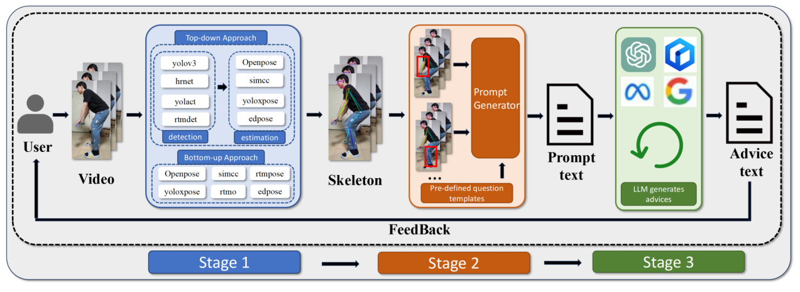

<!-- # ChatCoach 
ChatCoach实现的是一个基于姿态估计与大模型（LLM）的健身矫正系统，主要目标为未健身人士提供健身动作指导，主要功能为根据用户输入的视频文件得到相关的健身动作指导建议，我们的系统覆盖的健身动作共有8个常见的动作，分别为：二头肌弯举、前平举、平板支撑、杠铃深蹲、侧平举（哑铃飞鸟）、坐姿推肩、杠铃卧推和俯身划船。当用户输入做这些健身动作的一个完整动作的视频后，我们的视频会分析视频并结合大模型给出建议与反馈以提供动作矫正等方面的文本指导。 -->

# ChatCoach

ChatCoach is a fitness correction system based on pose estimation and large language models (LLMs). The primary goal is to provide fitness action guidance for individuals who are new to fitness.

### Key Functions

The main functionality of the system is to provide relevant fitness action guidance based on video files input by users. Our system covers 8 common fitness actions, which are:
- Bicep curl
- Front raise
- Plank
- Barbell squat
- Dumbbell lateral raise
- Shoulder push
- Barbell bench press
- Bent-over row

When a user inputs a video of performing a complete action of these fitness exercises, our system analyzes the video and combines it with the large model to provide suggestions and feedback for action correction and related textual guidance.

## ChatCoach System Overview

### Phase 1

The input is a video file for the visual model, where users can choose between top-down or bottom-up methods. If the top-down method is selected, two models are required; otherwise, one model suffices. The output is JSON-formatted skeletal joint information extracted from the video using pose estimation. For example, the OpenPose model extracts 18 key joints (e.g., nose, shoulders, elbows, etc.). We focus on these 18 joints for analysis and discard any additional keypoints.

### Phase 2

In this phase, JSON files from Phase 1 are input into the prompt generator, producing a prompt text. We analyze joint angles related to the fitness action to extract meaningful posture information. For instance, in a barbell squat, we calculate the angle between the thigh and the ground to assess the correctness of the movement. The prompt generator uses predefined templates to create prompts based on extracted angle information, incorporating expert knowledge on correct angle ranges for improved analysis.

Here is an example of a prompt generated by the prompt generator for the bent-over row action:
> "This is a bent-over row action. Below, I will provide some key skeletal angle information about this action from a side view. Please analyze whether this person's action is standard. If not, please provide suggestions. Here is some information: During the bent-over row, at the highest point, the elbow is above the torso (this is considered standard, indicating that the back muscles are adequately engaged). The angle between the thigh and the calf ranges from 121 degrees to 132 degrees (generally, 120 degrees to 160 degrees is considered standard; otherwise, too high or too low may hinder force exertion and potentially cause injury). The angle between the torso and the ground ranges from 115 degrees to 130 degrees."

### Phase 3

The input is the prompt from Phase 2. We use the [Kimi](https://platform.moonshot.cn/docs/api/chatlarge) model API from Moonshot to obtain relevant suggestions, which are displayed verbatim on the front end to provide user feedback.

### Input Requirements for the System
For the input of this system, the video should ideally include the full body of the individual performing the exercises. The table below outlines the requirements for the shooting angles of the videos for the eight fitness actions.

| Action Type                       | Static/Dynamic | Shooting Angle                   |
|-----------------------------------|----------------|----------------------------------|
| Bicep Curl                        | Dynamic        | Side                             |
| Front Raise                       | Dynamic        | Side                             |
| Plank                             | Static         | Side                             |
| Barbell Squat                     | Dynamic        | Side                             |
| Dumbbell Lateral Raise (Fly)     | Dynamic        | Front                            |
| Seated Shoulder Press             | Dynamic        | Front (shot from back to front) |
| Barbell Bench Press               | Dynamic        | Front (shot from head to feet)  |
| Bent-over Row                     | Dynamic        | Side                             |
## Usage
#### Platform
- OS: Windows11

- IDE: PyCharm

- need: pyqt5 , numpy  , math

**All models used for pose estimation are included in this repository.**
#### Running the System

`MainWindows.py` is the main code for running this system. Please configure the appropriate PyQt5 library in PyCharm to run the frontend interface. 

Simply run `MainWindows.py` to start the application.

We have placed some input videos in the `input_data` folder, and some example output videos for reference in the `result_videos_for_show` folder.
<!-- `MainWindows.py` 是运行本系统的主要代码，请在pycharm中配置相应的pyqt5库以运行前端页面。
只要运行MainWindows.py即可以运行。 -->

<!-- 
我们在input_data文件夹放置了一些可输入视频，在result_videos_for_show文件夹放置一些运行视频以供参考 -->
